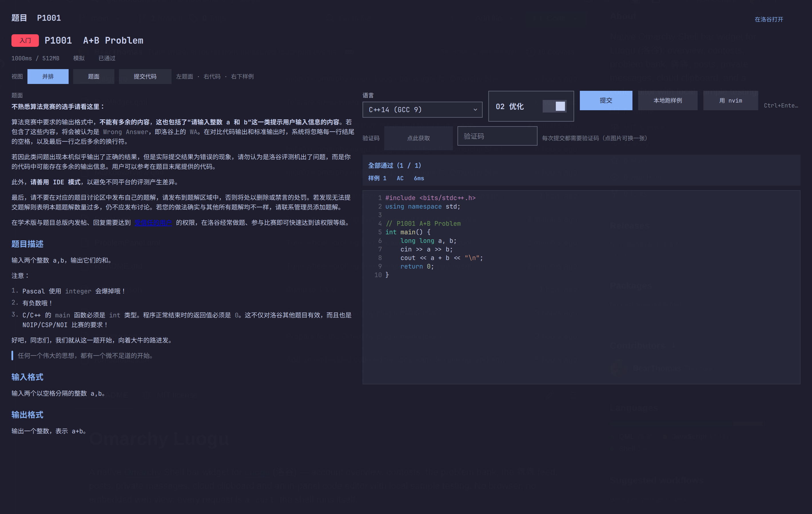
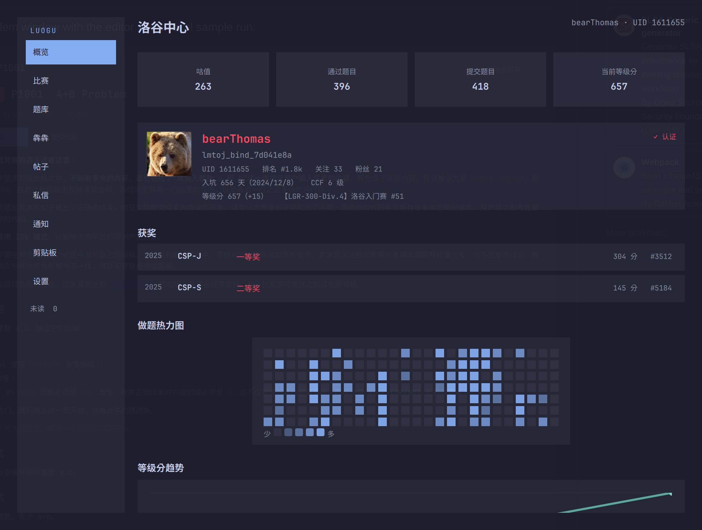

# Omarchy Luogu

A native [Omarchy](https://omarchy.org) Shell bar widget for [Luogu](https://www.luogu.com.cn)
(洛谷) — account overview, contests, the problem bank, the 犇犇 feed, posts, private
messages, cloud clipboard and an in-panel code editor with local sample testing.
No browser, no embedded web view: every request is a `curl` the shell runs itself.

洛谷的 Omarchy 状态栏插件：账号概览、比赛、题库、犇犇、帖子、私信、云剪贴板，以及一个
能本地跑样例的代码编辑器。

## Preview

The problem window with the editor and a local sample run:



The account overview (public profile data only — this account's):



## Features

| | |
|---|---|
| 概览 | avatar, name in your Luogu colour, 认证 mark, 签名/简介, 咕值 + breakdown, 等级分 with its delta and last contest, 排名/关注/粉丝, 入坑天数, CCF/XCPC levels, 获奖, 26-week solving heatmap |
| 比赛 | contest list (ongoing and finished) with a standalone detail window |
| 题库 | multi-factor search (keyword/difficulty/tag, 505 tags, sortable), problem statements with Markdown + LaTeX, 题解 list and full articles, per-problem discussion board |
| 交题 | language + O2 + captcha, then verdict polling with per-subtest results |
| 编辑器 | line numbers, syntax highlighting, auto-indent, bracket completion, `Ctrl+Enter` submit, `Ctrl+R` run samples, `Ctrl+/` comment; 「用 nvim」 hands the buffer to nvim and syncs saves back |
| 评测样例 | compiles and runs your code against the problem's samples **locally** (AC/WA/CE/TLE/RE with timings and diffs) — no submission, no waiting |
| 自测输入 | a paste-your-own-input box next to the samples: run the current code against data you type (edge cases, hand-computed extremes) and see stdout/stderr — same local pipeline, no submission |
| 犇犇 | the watching feed with names and colours, paging, and posting |
| 帖子 | thread reading with in-panel Markdown rendering, replies, new posts |
| 私信 | one conversation per user, user search by UID or name, infinite history |
| 云剪贴板 | list, view, copy, create, edit and delete pastes |
| 设置 | read your Luogu account settings (奖项认证 / 账号安全 / 第三方绑定) and edit 签名/简介/背景图 |

## Install

Listed in the Omarchy plugin marketplace as
[`bearthomas.luogu`](https://plugins.omarchy.org/plugin.html?id=bearthomas.luogu)
(verified snapshot). The install command is the same either way:

```bash
omarchy plugin add https://github.com/BearThomas/omarchy-luogu.git --enable
```

Then click the 洛 glyph in the bar (right section by default).

### Requirements

- Omarchy (Quattro) with Quickshell — the plugin is `bar-widget` kind.
- `curl`, `jq`, `base64`, `sed` — every request goes through them.
- `secret-tool` (libsecret) to store the session; without it the plugin falls back
  to a `0600` file under `~/.local/state/omarchy/`.
- Optional, only for 「本地跑样例」 and 「用 nvim」: `g++`/`gcc`/`clang++`, `python3`,
  `java`, `node`, `rustc`, `go`, `fpc`, and `nvim` + `omarchy-launch-terminal`.

### First run

Open the panel and log in once — the plugin stores the `_uid` and `__client_id`
cookies plus a scraped CSRF token and can then read and write on your behalf. It
only ever talks to `www.luogu.com.cn`.

## Settings

Five settings, declared in `manifest.json` (`barWidget.schema`) and read from the
widget's entry in `~/.config/omarchy/shell.json`. There is no schema editor in this
Omarchy version, so set them with the CLI:

```bash
omarchy bar set bearthomas.luogu refreshIntervalSec 300
omarchy bar set bearthomas.luogu iconText 洛
omarchy bar set bearthomas.luogu showUnreadBadge true
omarchy bar set bearthomas.luogu markdownBlockLimit 120
omarchy bar set bearthomas.luogu defaultLanguage "C++14 (GCC 9)"
```

## Privacy and what it writes

- **Credentials** live in `secret-tool` (or a `0600` file) and a small state file
  at `~/.local/state/omarchy/luogu-session.json`, written under `umask 077` and
  created `0600`. Nothing is sent anywhere except `www.luogu.com.cn`.
- The **login cookie jar** lives in a private `0700` directory
  (`$XDG_STATE_HOME/omarchy/luogu-login/`, file `0600`, removed after the login
  attempt) rather than at a fixed path in `/tmp` — `/tmp` is world-readable and a
  `curl -c` jar under a typical `022` umask is `0644`, i.e. readable by any other
  local account while it holds session cookies. Cleanup is confined to the files
  the plugin created: the trap removes the jar itself and then `rmdir`s the
  directory, which only ever succeeds while it is empty (an `rm -rf` on that path
  would have taken unrelated files with it).
- **It never writes your Omarchy configuration.** Settings are read from
  `shell.json`, never rewritten by the plugin.
- Writes go only where you ask: submitting code, posting, replying, sending a
  message, and creating/editing/deleting a paste — each behind its own button.
- 「本地跑样例」 compiles and executes your code **on your machine** with your own
  privileges, exactly like an IDE. It is never uploaded.
- 「用 nvim」 writes the buffer to `/tmp/luogu-edit/<pid>.<ext>` and opens nvim in a
  terminal; that directory is yours to delete.

## Removal

```bash
omarchy plugin remove bearthomas.luogu          # removes the plugin folder
rm -f ~/.local/state/omarchy/luogu-session.json # the saved session
secret-tool clear service omarchy-luogu         # the stored credentials
rm -rf /tmp/luogu-edit                          # scratch files, if any
```

## License

MIT — see [LICENSE](LICENSE).

## Development

```bash
omarchy plugin validate .
qmllint -I "$OMARCHY_PATH/shell" BarWidget.qml Panel.qml
```

Enable locally with:

```bash
omarchy plugin add "$(pwd)" --enable --yes
```

The widget stores the two login values in the desktop Secret Service through
`secret-tool`; they are not written to `shell.json` or this repository.

## Traps when touching the plugin

1. **Never add `X-Requested-With: XMLHttpRequest` to the homepage request that
   scrapes the CSRF token.** With that header Luogu answers `/` with a 37-byte
   stub, `<meta name="csrf-token" content=":)">`, so the widget would send `:)`
   as the token and every write would fail with `InvalidCSRFTokenException`
   (HTTP 400). The read endpoints under `?_contentOnly=1` do want that header;
   the homepage does not.
2. **Never add `curl -f` to a write request.** A rejected write comes back as an
   HTTP 4xx whose JSON body carries the real reason (`验证码错误`,
   `会话超时，请刷新页面后重试`). `-f` throws that body away, leaving an empty
   stdout, which is why failures used to surface as the useless
   "洛谷没有返回可解析的结果". The write commands therefore use `-sS` plus
   `-w '|%{http_code}'`, and parse the pair in `Model.js`.
3. **Never keep one `FloatingWindow` alive and toggle its `visible`.** Quickshell
   does not re-map a window the compositor has closed: setting `visible = true`
   afterwards succeeds silently and nothing appears. The details window has no
   decorations and no close button, so dismissing it with SUPER+Q *is* the normal
   path — a persistent instance therefore opened exactly once per shell session
   and then looked dead ("详细信息 点不开"). It is now declared inside a
   `Component` and created by a `Loader` with `active: detailOpen`, so every open
   is a fresh window and a compositor close just destroys the old one.

4. **`hl.dsp.window.float({ action = ... })`: use `"on"`, never `"set"`.** In this
   Lua dispatch API `"set"` is a **toggle**, and an unrecognised action (or none
   at all) also returns `ok` and toggles. So a repeating placement timer that
   sends `"set"` flips the window between floating and tiled on every tick and
   usually leaves it tiled. Omarchy's own binding uses the explicit
   `action = "toggle"`; `"on"`/`"enable"` are the idempotent force-float forms.

   The placement timer also cannot be a single shot. A new toplevel is not mapped
   yet at the first tick and Hyprland tiles it before it settles, measured as:
   tiled at ~300 ms → floating 980×740 by ~400 ms → **centered only from
   ~500 ms**. Two consequences:

   - `center` is resent on every tick, because it is computed from the width the
     compositor knows at that instant; calling it once early centres a 482-wide
     (tiled) window and parks it at x=518 instead of x=260.
   - `move` and `focus` stay single-shot: repeating `focus` would yank keyboard
     focus back for a second if the user clicks elsewhere right after opening.

   Quickshell 0.3.1 has no `Hyprland.clients`, so the compositor's own geometry
   cannot be polled from QML — hence convergence instead of a read-back. `float`,
   `move` and `resize` log nothing even when the selector matches nothing;
   `center`/`focus` do, which is why those wait for the second tick so a normal
   open leaves the journal warning-free.

5. **No QML edit is picked up by the shell's hot reload — restart the shell.**
   Omarchy does log `Local plugin changed, reloading: bearthomas.luogu`
   when a file under the plugin dir changes, but that notification does not
   re-read the QML: a probe in `Panel.qml`'s `Component.onCompleted` never ran
   after the reload notice, and a newly added `IpcHandler` function stayed
   `Function not found` until `omarchy-restart-shell`. The shell runs with
   `QS_DISABLE_FILE_WATCHER=1`, so the component cache keeps serving the old
   compilation. Deploy with a plain `cp` and restart — ~9 s, and it keeps
   `shell.json`.

6. **Feed rows must not hard-code their height.** A 犇犇 body is markdown and
   often long (a reply chain arrives as one string joined with `||`), so a fixed
   `height` makes the wrapped text spill out of its rounded box and paint over
   the entry below — which reads as doubled/garbled text ("有些犇犇容易重").
   Measured on real data: 8 of 19 entries needed more than the old 66 px, by up
   to 68 px. The delegate now derives its height from the content
   (`height: feedBody.implicitHeight + Style.space(20)`) with the inner `Column`
   anchored `left`/`right`/`top` only, plus `maximumLineCount: 6` with
   `elide: Text.ElideRight` so one long 犇犇 cannot swallow the page. The same
   trap applies to any list added later: either elide on a single line, or let
   the row size follow its content.

7. **A `Loader` whose height comes from `item.implicitHeight` must bind that
   height in `onLoaded`, not declaratively.** `height: item ? item.implicitHeight : 0`
   is evaluated while the item is still being built — before an inner `Repeater`
   has produced its delegates — so it reads 0, and the later real value looks like
   a re-entrant write. QML logs `Binding loop detected for property "height"` on
   the Loader. Measured on the block renderer: a `list` block reported
   `implicitHeight = 0` at `onLoaded` and the loop disappeared once the binding
   moved into `onLoaded: { item.block = …; height = Qt.binding(…) }`.

8. **A `Rectangle` (or bare `Item`) has `implicitHeight == 0`.** Anything the
   `Loader` measures by `implicitHeight` therefore collapses. Set
   `implicitHeight:` explicitly (and `height: implicitHeight`) for every
   non-`Text` block, or the block is laid out at zero height and paints over the
   block below it. A `Column`/`Row`, by contrast, sizes from its children's
   *actual* heights (verified: a `Rectangle { height: 40 }` alone in a Column
   gives `implicitHeight == 40`), so wrapping content in a positioner is enough.

9. **Do not read a parent's height inside a `Loader` item.** `anchors.verticalCenter:
   parent.verticalCenter` (or anything else deriving from `parent.height`) pulls in
   the Loader's height, which is itself derived from the item — a genuine height
   binding loop. Use a fixed offset computed from the component's own constants
   instead. Related: `childrenRect.height + N` bound to the height of an ancestor
   that this same height feeds is a loop too (reproduced in isolation), so size
   row backgrounds from an inner `Row`'s `childrenRect.height`, never from the
   enclosing `Item`'s own children.

10. **The details window's sidebar must stay outside the `Flickable`.** It used to
   sit inside it as the first child of a `Row`, so it scrolled away with the
   content — which is wrong for navigation. Now the `Row` holds the fixed
   sidebar plus a `Flickable` whose only child is the content `Column`.
   Verified by probe: with `contentY` moved from 0 to 1500 the sidebar's window
   position stayed at y=24.

11. **Qt's default wheel step is small for a 6000 px post, and this machine's
   touchpad is slower still.** `hyprctl getoption input:touchpad:scroll_factor`
   reports `0.4, set: true` (Omarchy's default in
   `/usr/share/omarchy/default/hypr/input.lua`), so two-finger scrolling arrives
   in the shell already at 40 % speed; `input:scroll_factor` (the mouse wheel) is
   1.0. The content `Flickable` therefore owns a `WheelHandler` that scrolls
   `Style.space(96)` per notch, or `pixelDelta * 2.5` for touchpad deltas (0.4 ×
   2.5 ≈ 1.0, i.e. back to a normal feel), and
   clamps `contentY` itself. Tune those two numbers (`wheelStep`,
   `wheelPixelFactor`) rather than fighting the global setting. Wheel events over
   the chat page's inner `ListView`s are consumed by them first, so only the page
   itself is affected.

12. **`qmllint` does not catch a stray `;` between QML object declarations —
   `qmlformat` does, and the QML runtime will not.** Writing
   `Text { … }; MouseArea { … }` (a JS habit) is a *parse* error for the QML
   engine but `qmllint` reports 0 errors on the same file, so `omarchy plugin
   validate` + `qmllint` both pass. The failure then looks completely silent:
   `BarWidget.qml` still loads (its `IpcHandler` answers), but
   `Loader { source: "Panel.qml" }` lands on `status === Loader.Error` with
   `item === null`, and since every BarWidget entry point is guarded with
   `if (panelLoader.item)`, **clicking the bar icon does nothing at all** and
   nothing is written to the journal.

   Two defences, both cheap:

   ```bash
   qmlformat BarWidget.qml > /dev/null   # exit code is the real syntax gate
   qmllint -I "$OMARCHY_PATH/shell" *.qml
   ```

   and when a widget "does nothing", read the Quickshell log rather than the
   journal — the parser error *is* recorded there, in the form
   `Panel.qml[2661:357]: Unexpected token ';'`:

   ```bash
   ls -l /proc/$(pgrep -f 'quickshell -n -p /usr/share/omarchy/shell')/fd | grep qslog
   ```

   A `Loader` status probe is the fastest way to confirm it: log `status` in
   `onStatusChanged` (0 Null, 1 Ready, 2 Loading, 3 Error).

13. **A Qt 6 positioner lays out only the *visible* children — which is exactly
   what makes a shared status line dangerous.** (`visible: false` children are
   skipped, so they cost nothing; an earlier version of this note claimed the
   opposite.) `detailColumn` starts with the action-status label
   (`"正在发送私信…"`, `"私信已发送"`, failures), and 私信 is the one page whose
   height is tied to the viewport instead of to its content
   (`height: detailFlick.height`, because it is an app-style page that scrolls
   internally). While that label is hidden the page sits at `y = 0`; the moment it
   appears the whole page is pushed down by the label plus the column spacing.
   Pressing Enter in the send box does both things in one handler — it sets
   `actionStatusText = "正在发送私信…"` *and* sends the message — so the page (and
   with it the send box at its bottom) visibly sank and the box ended up under the
   clip edge. Measured against the 692 px viewport:

   | | `chatPage.y` | composer bottom | overflow |
   |---|---|---|---|
   | status hidden | 0 | 672 | −20 (fits) |
   | status visible | 39 | 711 | **+19 (clipped)** |

   The fix is to subtract the page's own `y`, since a positioner places a child
   from the items *above* it and can therefore never feed back:

   ```qml
   height: Math.max(Style.space(240), detailFlick.height - Math.max(0, y))
   ```

   Both states now leave the same 20 px of slack (composer bottom 672 either way).
   The other pages do not need this: their `contentHeight` is
   `detailColumn.implicitHeight`, so they simply scroll.

   While fixing this, a stray copy of the 最近比赛 footer
   (`还有 N 场比赛，打开详细信息查看全部`) was found at the end of 私信 — it had
   been pasted into the wrong page and was only inflating the chat page. It is back
   in the 最近比赛 block it was written for.

### Contest problems open in their own window

A problem reached from the 洛谷比赛 window used to be opened by driving the
洛谷中心 window to its 题库 page (`openDetails(); openDetailPage("problems");
openProblem(pid)`). That hijacked the other window's navigation — its back button
then returned to the 题库 list rather than to the contest — and left two windows
fighting over one copy of the problem state. Now there is a third window,
**洛谷题目** (900×760), hosting `ProblemPanel.qml`.

`ProblemPanel.qml` is self-contained: it fetches its own statement, owns the
submit/verdict state and its own `Process`es, and is instantiated per window. It
takes `pid`, `uid`, `clientId`, `csrfToken`, a shared `tagTable` (it asks for one
through `requestTagTable()` if the 题库 page has not loaded it yet) and the usual
colour/font properties. The 题库 page inside 洛谷中心 still has its own copy of the
detail/submit UI — unifying the two onto `ProblemPanel` is the obvious next
cleanup.

### Every submission needs a captcha

Measured with a **valid** language and a deliberately too-short code (so nothing is
created): P1909, P1001 *and* the contest problem P17466 all answer
**`验证码错误` (403, `InvalidCaptchaException`)**. The earlier reading — "only
contest problems need one" — came from probing with an *invalid* language, which
is rejected earlier: the real order is **language → captcha → code length**. So a
submit UI without a captcha field can never succeed, and the JSON body carries
`{code, lang, enableO2, captcha}`.

Two things follow from that:

- **The captcha row is mandatory UI**, not a contest-only extra: `ProblemPanel`
  refuses to send without it (`请填写验证码`), fetches the image from `GET
  /api/verify/captcha` with the **same `Referer` as the submission** (the problem
  page — a session- and origin-bound captcha fetched from the homepage and used
  from the problem page is a plausible source of spurious `验证码错误`), and
  refreshes it automatically after any failure mentioning 验证码, because a captcha
  is single-use.
- **There is only one submit implementation.** The 题库 page used to have its own
  copy of the statement/submit/verdict UI *without* a captcha field, which is
  exactly why submitting from there always failed; it now renders `ProblemPanel`
  with `fetchDetail: false` and hands over the detail it already loaded. That
  deleted ~320 lines of duplicated state, processes and markup from `Panel.qml`
  (`prepareSubmission`, `submitSolution`, `pollRecord`, `setSubmitLanguage`,
  `submitProc`, `recordProc`, `recordTimer` and the `submit*` / `record*`
  properties).

### Contests

`GET /contest/list?_contentOnly=1&page=N` returns **20 per page including
already-finished contests** (`count` 1379), so the most recent past rounds are on
page 1 — they used to be invisible because the fetch sliced `[0:8]` and the
finished ones sit at positions 17-20. The list now keeps the whole page and pages
with 上一页/下一页.

List entries carry no sign-up field, so `joined` has to be probed per contest
(`GET /contest/<id>` → `data.joined`) — the fetch now does that **only for
contests that have not ended** (capped at 8), because a sign-up state is
meaningless once a round is over and each probe is another request.

`GET /contest/<id>?_contentOnly=1` holds the problem list at
**`data.contestProblems`** (each entry `{no:"A", score, problem:{pid,name,
difficulty,submitted,accepted}}`), *not* `contest.problems` — reading the wrong
path silently yields an empty problem list. `data.joined` is available here too.

The contest detail opens in its own `FloatingWindow` titled **洛谷比赛**
(860×700), built by `Loader { active: contestDetailOpen }` and placed by its own
`contestPlacementTimer` — the same pattern (and the same reasons) as 洛谷中心. A
problem row in it jumps to that problem in the 题库 page.

13. **A guarded `visible:` does not guard a sibling `text:`.** QML evaluates every
   binding on an object whether or not it is visible, so
   `visible: root.contestDetail !== null && root.contestDetail.problems.length > 0`
   next to `text: "题目 " + root.contestDetail.problems.length + " 题"` still
   throws `Cannot read property 'problems' of null` while the data is loading. Guard
   the expression itself (`root.contestDetail ? (…) : ""`). The quick audit that
   finds these: list every `root.<nullable>.<prop>` access whose line has no
   preceding `? `/`!== null`/`&&` — then check the multi-line ternaries by hand,
   since a guard on an earlier line does cover them.

14. **A page that fills the viewport cannot rely on the outer `Column`'s
   `implicitHeight`.** 私信 is the one page with an application layout (fixed
   height, its own inner scrolling) instead of a document layout, and it was
   measured broken like this: the chat row was 654 px tall at y=38 (so the page
   really occupied 692 px), yet `detailColumn.implicitHeight` reported **543** —
   the `Flickable` therefore sized its content to 543 and **clipped the bottom
   ~150 px, which is where the message composer lives**. Neither the `Math.max(520, …)`
   floor nor setting `height: detailFlick.height` on the page fixed the reported
   implicit height. What works is to stop asking and state it:

   ```qml
   contentHeight: root.detailPage === "chat" ? height : detailColumn.implicitHeight
   ```

   measured after the change: `flickH=692 contentH=692 contentY=0` for 私信
   (nothing to scroll, nothing clipped) while a long post still reports
   `contentH=7050`. Any future fixed-height page needs the same treatment — and a
   wheel event on the page background then does nothing, which is correct, while
   the inner lists keep scrolling by themselves.

15. **`Row` widths are hand-arithmetic, and the gap count is the easy part to get
   wrong.** Two rows in the contest UI were wider than their container: the page
   header was `(w-196) + 96 + 44 + 44 + 3×8` = **w+12** (so 下一页 poked past the
   edge) and the contest window's title row used `w-110` next to a 110 px button
   with `spacing: 10`, i.e. **w+10**. Prefer a flexible spacer over guessing:

   ```qml
   Text { id: heading; … }                        // no width — takes what it needs
   Item {                                          // absorbs the slack
     width: Math.max(1, row.width - heading.width - count.width - prev.width - next.width - row.spacing * 4)
     height: 1
   }
   ```

   Note `spacing * 4`: five children have **four** gaps, and the first attempt
   there subtracted three, which left the row 8 px too wide again — measured with
   a probe (`childrenRect` 772 vs `row.width` 764), not by eye. The audit that
   finds this class of bug statically is worth repeating after any layout edit:
   for every `Row` with `width: parent.width`, sum the fixed-width children, add
   `spacing × (children-1)`, subtract the amount the flexible child subtracts, and
   report rows where the result is positive. After the fix the same check reports
   0 and the measured `childrenRect.width == row.width == 764`.

16. **A `Flickable` is not a layout container.** Its direct children all sit at
   `y = 0`; only a positioner (`Column`/`Row`) inside it stacks them. The 洛谷题目
   window had a header `Row` and the `ProblemPanel` as two siblings inside one
   `Flickable`, so the problem text was drawn **on top of** the header ("文字重叠").
   Wrapping both in a `Column` fixed it, and the measured proof is the point:
   `kids=[y0/h28, y40/h1114]` — before the fix both were at `y0`. The
   `contentHeight` must also point at that wrapper (`problemBody.implicitHeight`),
   not at one of the children, or the header's height is missing from the scroll
   range. The same audit is worth re-running after any window edit: for every
   `Flickable`, list its direct children — more than one visual item (excluding
   `WheelHandler`s, which do not lay out) means overlapping content.

## User name colours

Luogu colours a user's name by reputation, and `Model.userColor()` is the single
place that turns the API's value into a hex colour. The value arrives in **two
different forms** and both must be accepted:

| source | value |
|---|---|
| 私信 (`/chat`, `/api/chat/record`) and 用户搜索 (`/api/user/search`) | a bare name — `"Red"`, `"Orange"`, `"Gray"` |
| 犇犇's HTML fragment | a CSS class — `"lg-fg-red"`, `"color-purple"` |

Matching only the class form (as it did) meant every name in 私信 fell back to the
default colour — the data was there, the matcher wasn't. The helper now strips a
`lg-fg-`/`color-`/`lg-` prefix when present and otherwise looks the bare name up
directly, covering gray/grey/blue/green/yellow/orange/red/purple/brown/black plus
`cheater`. It also passes through `#rrggbb` values unchanged.

Name colours are applied to: the 私信 conversation/search rows, the conversation
header (via `chatSelectedColor`, threaded through `openChatWith(uid, name, color)`)
and the 犇犇 rows. Chat *messages* now carry the sender's colour too
(`parseChatRecord` reads `sender.color`), even though the bubble itself renders
only the body.

## 犇犇 (feed)

Two different endpoints, and only one of them carries usernames:

| what | endpoint | shape |
|---|---|---|
| 关注动态 | `GET /feed/watching?page=N` | **HTML fragment** (`<li class="… feed-li">`), one block per post with `feed-username`, `/user/<uid>` and a timestamp |
| 关注动态 (JSON) | `GET /api/feed/watching?page=N` | `{status, data:[…]}` where each item is only `{uid, time, type, comment, _instance}` — **no name field at all** |
| 我的犇犇 | `GET /feed/my?page=N&_contentOnly=1` | HTML fragment, same shape as above (`_contentOnly=1` does *not* make this one JSON) |

The feed used to read the JSON API, so `Model.parseFeed` had no name to read and
every row fell back to 「洛谷用户」 (measured: **0 of 19** items had a name). The
fix is to read the HTML fragment and parse it — `Model.parseFeed` already routed
on a leading `<` to `parseFeedHtml`, which extracts uid, name, colour, time and
body. After the change: **10 of 10** items named for both 关注动态 and 我的犇犇.

**Paging.** Both feeds accept `page=N` and return 10 entries per page, oldest
page last, with **no overlap** between consecutive pages (measured: page 1/2/3 =
10/10/9 items, 0 shared). There is no "last page" signal — even `page=200` returns
a full fragment — so the widget appends the next page, de-duplicates by
`uid|time|content` (or by `data-feed-id` when the HTML carries one) through
`Model.mergeFeedItems()`, and hides 加载更多 once a page adds nothing new.
`refresh()` resets back to page 1.

Also worth knowing: `/feed` (no path suffix) answers with an error page, and
`profile.uid` is a **string** while feed `uid`s are **numbers**, so
`modelData.uid === root.profile.uid` is never true — compare with `String(…)`.

## Reading posts inside the panel (Markdown)

`GET /discuss/<id>?_contentOnly=1` returns `data.post.content` as **raw
Markdown** plus one page of `data.replies` (`perPage` 10, `&page=N` for the
rest). The plugin renders it itself instead of sending the reader to the site:
`Model.markdownBlocks()` turns the Markdown into block objects and
`MarkdownView.qml` lays them out, while `Model.inlineHtml()` converts inline
formatting to the slice of HTML Qt's rich text actually renders.

Blocks are laid out in QML rather than by feeding one HTML string to a single
`Text`, because QML rich text cannot fetch remote `` sources at all, while a
plain `Image` can — and does: a 3200×1800 post screenshot loads
(`status == Ready`) with no `Referer`, decoded at 2× the display width and capped
at 1400 px.

Supported: headings, paragraphs, bold/italic/strikethrough/inline code, links and
bare URLs (`<https://…>`), ordered/unordered lists with one level of nesting,
fenced code with a language label, 4-space indented code, blockquotes, `|---|`
tables with per-column alignment, `` images on their own line, `---`
rules, `$$…$$` display math, and `$inline$` math.

**Math is converted, not typeset.** Quickshell has no WebEngine, so KaTeX is not
an option; `Model.latexToHtml()` instead translates a LaTeX subset into Unicode
plus the `<sup>`/`<sub>` that Qt's rich text does render. The subset was chosen
from data, not guesswork: across 283 math snippets in 29 real statements and
posts the commands actually used were `\le` (58), `\times` (18), `\leq` (9),
`\Theta`, `\cdots`, `\ldots`, `\ge`, `\sim`, `\sum`, `\frac`, `\approx`,
`\bm`, `\gcd`, `\bmod`, `\log`, `\ne`, `\max`, `\limits`, `\in`, with 28
superscripts and 48 subscripts. Covered: Greek letters, relations/operators
(`≤ ≥ ≠ ≈ ∈ × ÷ ± ∑ ∫ ∞ ⋯`), `^`/`_` (with braces), `\frac`, `\sqrt[n]{}`,
`\text`/`\mathrm`/`\operatorname`, `\bm`/`\mathbf`, `\left`/`\right`,
spacing commands, `\bmod`/`\pmod`, accents, and `\begin{}`/`&`/`\\` for
matrices (flattened). Two details that make it read like typeset math instead of
a token stream: a control word swallows **one following space** (LaTeX semantics,
so `1\le n` is `1 ≤ n` and not `1≤ n`), and relations/operators get **padding on
both sides** the way TeX's math spacing does — while letter-like symbols (`α`,
`⋯`, `∞`) stay tight. Regression on the same 283 snippets: **0 leftover `\command`,
0 unbalanced `<sup>`/`<sub>`, 0 doubled spaces**. What cannot be converted
(matrices, `cases`, alignment) degrades to readable flattened text rather than
being dropped. A blockquote's inner Markdown is flattened to
inline formatting (a fence or table *inside* a quote stays literal text). A post
is capped at 120 rendered blocks behind a "展开其余 N 段" button, because
everything lives in an un-virtualised `Column` inside the details window's
`Flickable` — the largest post sampled (22 KB) is 294 blocks.

## 题库 (problem bank)

Everything the judge flow needs is reachable over the same direct-HTTP pattern;
the only things that had to be *found* rather than guessed are the enum tables
and the submission body.

| what | endpoint | notes |
|---|---|---|
| 搜题 | `GET /problem/list?_contentOnly=1&page=&keyword=&difficulty=&tag=&type=` | `data.problems{count,perPage:50,result[]}`; verified `difficulty=2&tag=1` narrows 17523 → 479 |
| 排序 | `&orderBy=difficulty&order=asc\|desc`, `&orderBy=pid&order=desc` | only these accepted; anything else falls through to an HTML error page |
| 标签表 | `GET /_lfe/tags/zh-CN` | `{tags:[{id,name,type,parent}]}`, 505 entries; **type 2 + `parent: null` = the 22 algorithm categories** that make a usable dropdown |
| 看题 | `GET /problem/<pid>?_contentOnly=1` | `data.problem.content{background,description,formatI,formatO,hint}` (all Markdown), `samples` = array of `[input, output]` pairs, `limits`, `tags` (ids), `submitted`/`accepted`, plus `data.lastLanguage` / `data.lastCode` (the solver's previous submission) and `data.discussions` |
| 题解列表 | `GET /problem/solution/<pid>?_contentOnly=1` | `data.solutions{count,perPage:10,result[]}`; long entries arrive truncated |
| 题解全文 | `GET /article/<lid>?_contentOnly=1` | a solution *is* an article; `data.article.content` is the full Markdown |
| 题目讨论 | `GET /discuss?forum=<pid>&_contentOnly=1` | each problem has its own board whose slug **is the pid** (`data.forum.slug`), independent of the 30-post default list |
| 交题 | `POST /fe/api/problem/submit/<pid>` | JSON `{code, lang}` + `X-CSRF-Token`; a bad `lang` answers `record.invalid_language_type`, and code shorter than the minimum answers `代码过短` — both *before* a record exists, which is what makes it safe to probe |
| 评测结果 | `GET /record/<rid>?_contentOnly=1` | `data.record{status,score,time,memory,sourceCode,…}` + `data.testcaseGroup`; list at `/record/list?_contentOnly=1` |

The numeric enums (difficulty, language, verdict) are Luogu's own frontend tables,
recovered from the locally installed `vscode-luogu` bundle rather than guessed:
difficulties 0-8 (`暂无评定` … `NOI/NOI+/CTS`, each with its official colour),
languages 1-34 (`C++14 (GCC 9)`=28, `C++23`=34, …), verdicts 0-23
(`12`=Accepted, `6`=Wrong Answer, `5`=TLE, `2`=Compile Error, …). They live in
`Model.js` as `PROBLEM_DIFFICULTIES`, `JUDGE_LANGUAGES`, `JUDGE_STATUS`.

The statement is reassembled into one Markdown document by
`Model.problemStatementMarkdown()` — sections in the order a solver reads them,
with each sample wrapped in a `text` fence so its whitespace survives. That goes
straight into `MarkdownView`.

### Submitting

`POST /fe/api/problem/submit/<pid>` takes JSON `{code, lang, enableO2}` plus
`X-CSRF-Token`. Two things about it are worth keeping in mind:

- **The payload goes through stdin as one line of base64.** Quickshell's `Process`
  exposes `write()` but **no way to close stdin**, and `curl --data-binary @-`
  waits for EOF — so that combination hangs the request until `--max-time` kills
  it (observed). Passing the code as an argv instead would be asking for quoting
  trouble, and `Qt.btoa(string)` is deprecated *and* differs from the web
  behaviour on non-ASCII input, which matters because submitted code is full of
  Chinese comments. So `Model.utf8Base64()` (hand-written, UTF-8, verified
  byte-for-byte against Node's `Buffer.toString("base64")`) encodes the JSON, the
  shell script reads exactly one line (no EOF needed), decodes it to a `mktemp`
  file and hands that to curl with `--data-binary @file`.
- **Failure is free.** Language and code length are validated *before* a record is
  created, so a probe with a bogus `lang` answers `record.invalid_language_type`
  with zero side effects — the whole submit → poll path was built and checked that
  way, and the account's 1179 submissions were untouched.

The verdict is polled from `GET /record/<rid>?_contentOnly=1` every 1.5 s while
the status is 0/1 (Waiting/Judging). Per-testcase results come from
`data.record.detail.judgeResult.subtasks[].testCases[]`, compile failures from
`detail.compileResult`, and both are rendered as a verdict card.

Also supported on the problem page: the per-problem discussion list
(`/discuss?forum=<pid>`, 30 per page) and a thread view with Markdown-rendered
replies, paginated the same way as the 帖子 page.

## The code editor, sample running and the nvim escape hatch

### Layout

One view control (视图) with three states — 并排 (side by side), 题面 (statement
only) and 提交代码 (code only) — and **the statement and the code pane each exist
exactly once**; the control only reallocates their widths. That matters: an earlier
version instantiated the same two `Component`s from four `Loader`s (one pair per
layout), and the window's code pane came out with `visible: false`, so the code and
its 提交 button were unreachable no matter what was clicked. One instance per pane
removes that whole class of failure.

并排 needs 880 px of panel width and is greyed out below it, falling back to 题面:
洛谷中心's 题库 page only has ~764 px (the sidebar takes the rest), and splitting
that squeezes the statement into a 336 px strip. Measured after the fix — problem
window: `stmtPane=true@602x620 codePane=true@766x620`; 题库 page:
`stmtPane=true@764x648 codePane=false`; 提交代码 in the window:
`codePane=true@1380x452`.

The problem window opens in **split mode**: statement on the left, code on the
right, and the local sample results directly under the code, at 1420×900. The
左右分栏 / 标签页 toggle switches back to the tabbed layout.

**The split layout is skipped when there is no room for it** (`splitLayout` is
`layoutMode === "split" && width >= 880`). The same `ProblemPanel` is used by the
题库 page inside 洛谷中心, where the sidebar leaves only ~764 px — splitting that
into two columns squeezes the statement into a 336 px strip, which reads as "the
problem is broken". Below the threshold the panel falls back to the tabbed layout
and the statement gets its full width. Measured after the fix: 题库 page
`panelW=764 splitLayout=false stmtW=764`, standalone window
`splitLayout=true stmtPaneW=602`.

### Alignment is a construction problem, not a tuning problem

The caret drifting away from the text it is editing is the classic failure of the
"highlight layer under a transparent editable layer" trick. Two rules keep them
together, and both were learned the hard way:

1. **Both layers must be the same QML type.** A `Text` for the highlighting and a
   `TextArea` for editing lay out differently (different content offsets and, as
   measured, a different line height: 18.5 by the font metrics versus 15 as the
   editable control actually laid it out). Both layers are now `TextEdit`, so the
   layout engine is literally the same one; `TextEdit` also supports
   `cursorDelegate`, which is what draws the caret over transparent text.
2. **RichText collapses runs of spaces**, so indentation vanished from the
   highlighting layer and that text appeared shifted left. `Model.highlightCode`
   now emits `&nbsp;` for spaces (and expands tabs to four), so the two layers
   contain the same number of the same characters at the same positions.

Verified by measurement rather than by eye: for an 8-line file both layers report
`contentHeight = 120` with `topPadding = leftPadding = 0`.

### Scrolling, chips and paging

- Every scrollable surface routes the wheel through one helper
  (`wheelStepFor` + `applyWheel`) with `wheelStep` 220 / `wheelPixelFactor` 5.0.
  The numbers came from instrumenting the handler and reading 181 real events off
  this machine's touchpad: each event carries **both** `pixelDelta ≈ 5–11` **and**
  `angleDelta ≈ ±120`, and Qt's default scrolls a `Flickable` by the pixel delta —
  i.e. 5–11 px per event, which is what made scrolling feel slow here (Omarchy's
  touchpad `scroll_factor` is 0.4). Tuning by the `angleDelta / 120` branch, as this
  code first did, changes nothing on a touchpad because that branch never runs.
  Measure the events before changing the numbers: add a `console.log` inside
  `wheelStepFor` and read the log.
- The first-party panels in the same shell (clipboard, menu, bluetooth) carry **no**
  wheel handling at all — they take Qt's default — so this plugin is the one that
  has to compensate.
- **Difficulty chips size themselves to their text**
  (`Math.max(minWidth, label.implicitWidth + padding)`). They used to be fixed
  (56 px in the problem header, 54 px in the 题库 list, 46 px in a contest's problem
  list) and one of them additionally cut the name with `.slice(0, 4)` — so
  「普及+/提高」 rendered as 「普及+/」 and the longer names
  (「省选/NOI-」, 「NOI/NOI+/CTSC」) were clipped. Measured now:
  「提高+/省选-」 → text 58 px, chip 70 px.
- The 题库 list carries its 上一页/下一页 controls **both above and below** the list
  — a page holds 50 problems, so the controls are a long scroll away otherwise.

### Autocompletion

Typing offers up to eight candidates under the caret: keywords and types for the
current language plus snippets, each with its own **trigger** word (so `mai`
offers `int main() {`, `bi` offers `#include <bits/stdc++.h>`, and `for` offers the
whole loop — the plain `for` keyword is dropped once it has been typed, because
the snippet is what is useful there). `↑`/`↓` select, `Enter`/`Tab` accept, `Esc`
dismisses, `Ctrl+Space` re-opens it. The candidate list lives in `Model.js`
(`completionMatches`), so it is unit-testable with `node`.

`CodeEditor.qml` is a hand-rolled editor, because QML ships nothing with syntax
highlighting:

- The **highlight layer** is a `Text` with `textFormat: Text.RichText`, fed by
  `Model.highlightCode(code, language, dark)` — a small scanner that colours
  comments, strings, numbers, keywords, types and call names (VSCode's dark and
  light palettes). Every newline must be emitted as `<br/>`, and HTML must be
  escaped, or the layer and the editable layer drift apart.
- The **editable layer** is a `QQC.TextArea` on top with `color: "transparent"`.
  The caret therefore needs `cursorDelegate` (a 2px `Rectangle`) or it is
  invisible too; selection still shows through `selectionColor`.
- **`NoWrap` + horizontal scrolling is mandatory.** With wrapping, the two layers
  break lines at different points and the whole document misaligns. It also
  matches VSCode's default.
- **Line height has to be measured, not derived.** The gutter, the highlight layer
  and the editor must agree on a line height; my formula (`FontMetrics.height +
  0.35 * pixelSize`) gave 18.52 while the TextArea actually lays out at **15** for
  an 11px font, so the gutter drifted away from the code as soon as you scrolled.
  The editor now reads `(contentHeight - topPadding - bottomPadding) / lineCount`
  and drives all three layers from it — verified on an 8-line file:
  `gutterH = highlightH = editorH = 120`.
- Keys: `Tab` indents, `Enter` keeps the indentation (and adds one level after
  `{` / Python `:`), brackets and quotes auto-close, `Ctrl+/` toggles a line
  comment, `Ctrl+Enter` submits, `Ctrl+R` runs the samples.

### 评测样例 runs locally

`run-samples.sh` takes one base64 JSON line on stdin
(`{language, code, timeLimitMs, samples:[{input, output}]}`) and answers
`{compile:{ok,message}, results:[{index,status,timeMs,stdout,expected,stderr}]}`.
It compiles in a temp dir with `g++`/`gcc`/`javac`/`rustc`/`go`/`fpc`, interprets
with `python3`/`node`, runs each sample under `timeout (limit + 2s)`, and compares
with trailing whitespace and trailing blank lines normalised — the same way a
judge does.

**The tested program's output is never captured into a shell variable.** A time
limit does not bound output, so a program that prints in a loop can exhaust memory
long before it is killed — with `while (true) putchar('x')` the first version of
this script peaked at **678 MB and took 12.9 s** for a 1-second limit. The output
now goes straight to a file, the run happens under `ulimit -f 8192` (4 MB, so a
runaway program is killed by `SIGXFSZ`), only a 64 KB prefix is read for the
comparison, and the JSON reports `stdoutBytes` so an oversized run is visible
instead of silent. Same program now: **3.7 MB peak, 2.1 s**, reported as
`RE` with 「输出过大：超过 4MB 上限，已被终止」. Verdicts **AC / WA / CE / TLE / RE** with the diff and timing.
Nothing is sent to Luogu and no submission record is created. (It does execute
your code locally with your own privileges, exactly like an IDE would.)

### 自测输入 (paste your own input)

The problem's samples are fixed, and the interesting cases are usually the ones
nobody shipped a sample for — a boundary, a hand-computed extreme, four lines of
random data. 「自测输入」 puts a paste box under the sample button: type or paste
whatever you want on stdin, press 「用这组输入运行」, and the same local pipeline
runs the current buffer against it.

Because there is no expected output, no verdict is invented: the panel shows
「自测完成　37ms」 and prints **程序输出** / stderr verbatim (a run is only tinted
red when it crashes or times out). Internally it is the identical call as 跑样例 —
one sample, `output: ""` — so there is no second code path to go stale. Verified
on the live window with a Python solution of A+B and input `3 4`: `compile ok`,
`stdout "7"`, 37 ms.

### nvim, for people who want the real thing

Quickshell has no terminal widget, so a real nvim cannot be *embedded*. Instead
「用 nvim」 writes the buffer to `/tmp/luogu-edit/<pid>.<ext>` (the file must exist
before the watcher starts — `FileView` cannot observe a file that does not exist
yet), launches `omarchy-launch-terminal nvim <file>`, and a
`FileView { watchChanges: true }` syncs every save straight back into the editor.
Verified end to end: write → launch → external edit → `已从 nvim 同步（113 字）`.

### Two traps this cost

- **`ScrollBar.vertical:` needs the qualified name** when the module is aliased
  (`import QtQuick.Controls as QQC`). Writing bare `ScrollBar.vertical: ` fails as
  *Non-existent attached object*, which cascades: `CodeEditor` unavailable →
  `ProblemPanel` unavailable → **the whole plugin fails to load**. `qmllint`
  reports 0 errors; only the runtime log says so.
- **A duplicate method name silently kills the widget.** Patching the deployed
  `BarWidget.qml` twice left two `edresult`/`ednvim`/`ednstate` definitions; the
  log said `Duplicate method name` and the widget never registered — no IPC target
  (`Target not found` for every call) and the bar slot lost its 洛 icon. A grep
  whose output I had truncated with `head` is what hid the existing definitions.

## 云剪贴板 (paste)

Read side, fully mapped:

| what | endpoint |
|---|---|
| my pastes | `GET /paste?_contentOnly=1&page=N` → `data.pastes{count, perPage: 10, result: [{id, user, time, public, updateAt, data}]}` |
| one paste | `GET /paste/<id>?_contentOnly=1` → `data.paste{…same fields…}` plus `data.canEdit` |

The content field is called **`data`** (not `content`), the ids are 8-char slugs
(`3g3b7g16`) and pagination works the same way as the feeds. The 剪贴板 page lists
them, opens one (monospace, selectable), copies the body or the `/paste/<id>` link
into the system clipboard (a hidden `QQC.TextArea` + `selectAll()/copy()` — verified
by reading the clipboard back with `wl-paste`).

### Writing to a paste: the routes come from `/_lfe/config`, not from the docs

The community API docs (`0f-0b.github.io/luogu-api-docs/pastes`) say creation is
`POST /paste/new`. **That route is gone** — the live server answers
`405 Method Not Allowed (Allow: GET)`, and so does `/paste/<id>` for every write
verb. The authoritative list is Luogu's own front-end config:

```
GET /_lfe/config   →   route.paste.new  = /paste/new
                       route.paste.create = /paste/_new      ← 真正的创建接口
                       route.paste.edit = /paste/_edit
                       route.paste.batch_operate = /paste/_batop?method=…
                       route.paste.list = /paste
                       route.paste.show = /paste/{id}
```

`route.*` maps every route name to its path (it also confirms, e.g.,
`route.api.problem.submit = /fe/api/problem/submit/{pid}` and
`route.api.verify.captcha = /api/verify/captcha`), which makes it a far better
discovery tool than guessing paths. Writing is then:

| action | request | body | notes |
|---|---|---|---|
| 新建 | `POST /paste/_new` | `{data, public, captcha}` | returns `{id}`; **needs a captcha** |
| 编辑 | `POST /paste/_edit` | `{id, data, public, captcha}` | returns `{id}` |
| 删除 | `DELETE /paste/_edit?id=<id>` | *(no body)* | needs **no captcha** (confirmed by a browser capture: 200 OK) |
| ~~批量~~ | ~~`POST /paste/_batop?method=…`~~ | — | never needed: the real delete is the DELETE above |

Two details the capture settled that no amount of probing could: **deletion is the
`DELETE` verb on the *same* `_edit` path** with the id in the **query string**
(`?id=`), and it is not captcha-guarded — so `_batop` (whose `method` value is only
validated *after* the captcha) was a red herring. The id is accepted from the query
for the edit too, so the page now sends it both ways. Editing is therefore the only
captcha-optional write: creation demands one, editing sends one only if the user
fills it in.

The captcha here is the **new** system (`/lg4/captcha`, exception
`CaptchaChallengeException`) and is *not* the one submissions use
(`/api/verify/captcha`, `InvalidCaptchaException`) — different endpoints, verified
by the exception class each route raises. The payload key is `captcha`: sending
`{"captcha": {"code": "x"}}` answers
`Input value "captcha" contains a non-scalar value`, which is how the field name
was confirmed rather than guessed.

Verified through the widget: the captcha image loads (2699-byte data URL), a wrong
code is reported as `失败：图形验证码错误`, the captcha refreshes itself afterwards,
an edit against a nonexistent id answers `PasteBin not found` (so the request
shape is right), and the paste count stayed at 34 throughout — no stray data.
The final "type the real captcha" step is the user's.

**Old note (superseded):** `/paste`
answers `405 Method Not Allowed` to POST, and `POST/PUT/PATCH/DELETE` on
`/paste/<id>` are all 405 too (only GET is allowed there), while ~35 guessed paths
(`/api/paste`, `/api/paste/create`, `/api/paste/new`, `/fe/api/paste`, `/paste/save`,
`/api/cloudpaste`, …) are all 404. The page HTML cannot help either: it answers the
same 302 self-loop as `/user/setting` for non-browser clients, so its JS bundle —
which would name the route — is unreadable. One devtools capture of a real "create"
request settles it.

## 洛谷账号设置 (read-only)

Three GET endpoints back the 设置 page in the sidebar:

| section | endpoint | payload |
|---|---|---|
| 奖项认证 | `GET /user/setting/prize?_contentOnly=1` | `{hasRealName, prizeLevel:{oi:{level},xcpc:{level}}, prizes:[{prize:{year,contest,event,prize,score,rank,name,affiliation,type}, showLevel}]}` — `name`/`affiliation` are the **verified real name and school** |
| 账号安全 | `GET /user/setting/security?_contentOnly=1` | `{email, phone, realName, totpSet, usernameUpdateTime, adminLogs}` — phone and realName come **masked** (`86134*****652`, `熊**`) |
| 第三方绑定 | `GET /user/setting?_contentOnly=1` | `{qqGroupToken, vjudgeAccounts:[{username,oj}], openidAccounts:[{username,platform}]}` |

`/user/setting/<name>` only answers for `prize` and `security`; `profile`, `info`,
`account`, `bind`, `privacy`, `notification`, `email`, `phone`… all 404.

### Editing 个人信息

`POST /user/setting/userSpace` writes the space settings. Three things about it
matter, all measured:

- **It is a partial update.** An empty body answers `{"id":<uid>}` and changes
  **nothing**, and only the keys present in the body are touched — so the page
  sends just the fields the user actually edited and leaves the rest alone.
  Body: `{slogan?, introduction?, background?}`, plus `X-CSRF-Token` (scraped from
  the homepage `<meta name="csrf-token">`, as for every other write).
- `GET` on it answers **405 Method Not Allowed** — that is how the route was
  confirmed to exist after the guesses came back 404.
- Round-trip verified through the widget itself: write `introduction`, re-read the
  profile and see the value, then write `""` back — the profile ended
  **field-for-field identical** to the snapshot taken first.

One bug this nearly shipped: the save compares the form drafts against
`profile.<field>`, and `profile.background` was missing from `parseProfile`, so
the comparison was `"" !== undefined` — true — and **every** save also sent an
empty `background` (which would have wiped the user's space background if the
server had not ignored the empty string). Normalise both sides
(`value ?? ""`) before comparing, and keep `parseProfile` complete.

**Editing 奖项认证/账号安全 is not implemented**: those write routes are still
unknown — the settings page HTML answers a 302 loop to non-browser clients, so its
JS bundle (which names them) cannot be read. The write endpoints
are not discoverable from here: the settings *page* HTML answers a 302 loop back to
itself for anything that is not a real browser (`ws-action: cc` from Luogu's CDN),
so its front-end bundle — which would name the update routes — cannot be read, and
plain guesses (`/api/user/update`, `/api/user/setting/update`, `/api/user/profile/
update`, …) all 404 while a genuine write route is distinguishable by its
`403 InvalidCaptchaException`/`400` answer. To add editing, capture the request in
the browser's devtools (change a field, copy the URL, headers and body) and it can
be wired up the same way as the submission flow.

## Discussion writes: captcha and boards

Both discussion writes (`POST /api/discuss/post`, `POST /api/discuss/reply/:id`) are
captcha-gated, and the server checks the captcha **before** title, content or
board — an empty content probe still answers `InvalidCaptchaException`
(`验证码错误`, 403). Two different captcha endpoints exist:

| endpoint | used for | look |
|---|---|---|
| `/lg4/captcha` | login | dark background |
| `/api/verify/captcha` | discussion writes | random background |

The image is bound to the session cookies, so it is fetched with the widget's
own `_uid`/`__client_id` and the typed code is sent as `captcha`. Its mime type
is carried through from `%{content_type}` (`image/jpeg`) rather than assumed —
the login form's hard-coded `data:image/png;base64,` prefix is wrong for the
JPEG it actually receives. A captcha is single-use: after any failed attempt the
widget immediately fetches a fresh image, and each form (post / reply) keeps its
own, because sharing one image makes the second form fail.

Boards are slugs, not letters: `data.publicForums` (also returned by
`GET /discuss`) lists `academics` = 学术版, `problem` = 题目总版,
`siteaffairs` = 站务版. The old default `P` matches no board — the read API
returns an empty forum name for it. `Model.parseForums` reads the list and puts
学术版 first as the default, falling back to the three known boards.

**Posting permission is per board, not per account.** `GET /discuss?forum=<slug>`
reports `canPost` for that board alone; with no `forum` parameter it is the
aggregate and reads `false`. Verified live: `academics` and `problem` are `true`,
`siteaffairs` is `false`. `forumPermProc` asks each board once per details-window
session, `Model.parseForumPermissions` turns the answers into the dropdown
options, boards that refuse are labelled `（无发帖权限）`, and `publishPost()`
refuses before spending the captcha.

**A write is only successful on positive evidence.** `writeResponseSucceeded`
used to default to success when it could not parse the answer — an empty body,
an HTML page, or a JSON object with no `status` field. That is how posting to
站务版 (no permission) reported "帖子已发布" while nothing was published. Now it
requires an explicit `status`/`code`/`errorCode` of 0 or 200 (or, for a JSON body
without one, a payload that is neither `false` nor `null` and carries no error
field), and an empty or non-JSON body is never a success. `writeFailureMessage`
also returns an excerpt of an unclassifiable body, or says the result cannot be
confirmed, instead of a vague "洛谷没有返回可解析的结果".

The write endpoint is rate limited: a burst of attempts answers
`FrequentRequestException` (`请求频繁，请稍候再试`, 403), which the UI now shows
verbatim instead of a generic failure.

## Settings

The widget declares five user settings in `manifest.json` under
`barWidget.schema` (`integer` / `boolean` / `string` / `enum` are the types the
shell's settings UI understands):

| key | type | default | effect |
|---|---|---|---|
| `refreshIntervalSec` | integer 30–3600 | 300 | the bar refresh timer (`BarWidget.qml`) |
| `iconText` | string | `洛` | the glyph in the bar slot |
| `showUnreadBadge` | boolean | true | the unread count badge |
| `markdownBlockLimit` | integer 20–600 | 120 | blocks rendered before 展开 collapses the rest (all 6 `MarkdownView` uses) |
| `defaultLanguage` | enum | `C++14 (GCC 9)` | submission language when a problem has no history (`Model.languageIdByName` converts the name to the numeric id the API wants) |

**Where the values live is the trap.** They are **direct keys on the widget's
`bar` layout entry** in `~/.config/omarchy/shell.json`, *not* nested under a
`settings` object — `BarModel.entrySettings()` simply copies the entry and drops
`id`, and the bar assigns that copy to the widget's `settings` property. So it is

```json
{ "id": "bearthomas.luogu", "iconText": "洛谷", "refreshIntervalSec": 120 }
```

exactly like the first-party `omarchy.clock` entry and its `format` key. Writing
`{"id": "...", "settings": {…}}` instead silently nests everything one level too
deep and every `setting()` call falls back to its default.

**How to set them.** There is no GUI editor for a plugin's schema in this
Omarchy version — even first-party plugins (`omarchy.agents`, `omarchy.clock`)
report `schema: []` through `omarchy-shell shell listPlugins`, because the shell
reads a top-level `meta.schema` that nobody populates; `barWidget.schema` is
declarative metadata. The working path is the CLI, which also **does not validate
key names** (a typo is written happily and silently does nothing):

```bash
omarchy bar set bearthomas.luogu iconText 洛谷
omarchy bar set bearthomas.luogu refreshIntervalSec 120
omarchy bar set bearthomas.luogu markdownBlockLimit 40
omarchy bar set bearthomas.luogu defaultLanguage "C++20"
omarchy bar set bearthomas.luogu showUnreadBadge false
```

Without `--json` every value is written as a **string**, which is why the reads
coerce: integers go through `Number(...)`, and the boolean is compared as
`String(value) !== "false"` — the string `"false"` is truthy in JS, so a plain
`setting("showUnreadBadge", true)` would have left the badge on.

Verified live by seeding those keys and restarting: `icon=洛谷`,
`timerIntervalMs=120000` (was 300000), `mdLimit=40`, `defaultLangId=27` for
`C++20`. The test values were then removed so the shipped defaults apply; the
editor in Omarchy's bar settings writes the same shape.

## Current scope

- Circle bar icon matching the native Omarchy icon slot, with an unread badge
  (private messages + notifications, capped at `99+`) and a 5-minute refresh.
- Optional Cookie login and identity validation.
- Password login with Luogu captcha, following the direct-request flow used by
  `vscode-luogu`; passwords are passed through stdin and never stored.
- User profile, Guzhi breakdown, ranking, level-score trend and a 26-week
  solving heatmap.
- 概览 identity card: avatar, name in the user's Luogu colour, 认证 mark,
  签名/简介, UID/排名/关注/粉丝, 入坑天数 and CCF/XCPC levels, plus the latest
  等级分 with its delta and contest name, and the 获奖 list (`data.prizes`).
- Contests: the latest 20 per page (finished rounds included), each opening a
  standalone 洛谷比赛 window with the time, host, problem list and description;
  notifications, and the 犇犇 feed.
- 私信 as a real conversation UI: conversation list, user search by name or UID,
  per-user message thread, and a composer (Enter sends).
- Discussion posts read inside the panel with Markdown rendering, plus create /
  reply forms using the board captcha.
- 题库: multi-factor search (keyword / difficulty / 22 algorithm categories /
  sort), problem statements rendered from Markdown, 题解 (list + full text),
  per-problem discussions, and submission — language picker (from the problem's
  accepted languages, defaulting to your previous choice), an O2 toggle, a code
  editor prefilled with your last submission for that problem, and a verdict card
  that polls until judging finishes.
- Refresh and logout controls.

Known gaps: the code editor is a plain monospace text area (no syntax
highlighting, no line numbers), and math in statements is shown as tinted
monospace because there is no LaTeX engine. Daily punch, automatic punch and
contest charts remain on the list.
